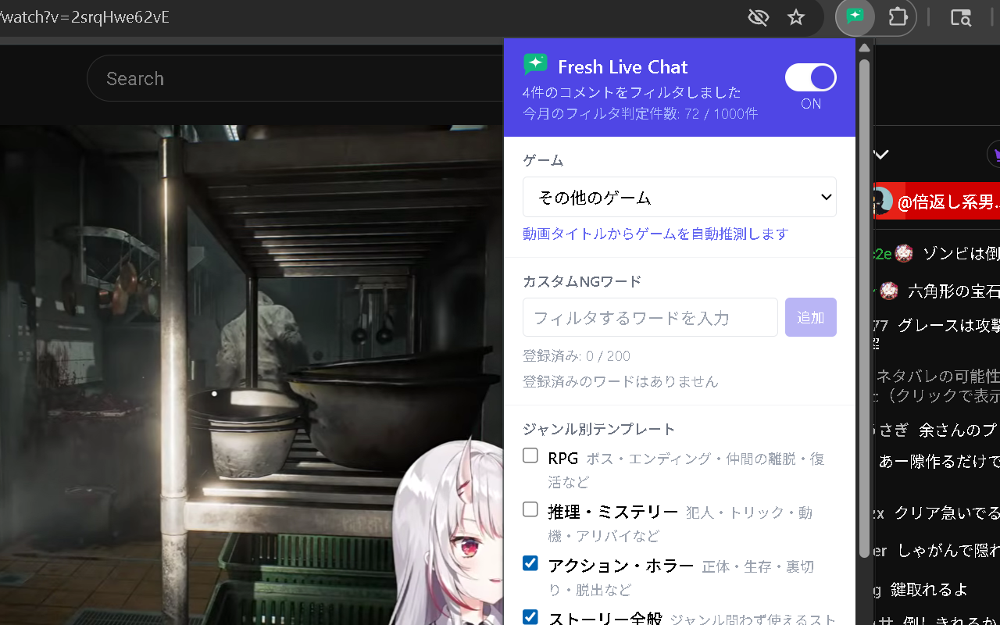
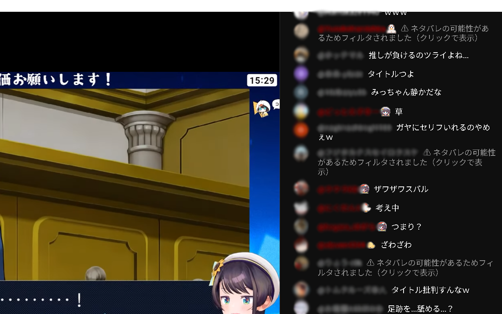
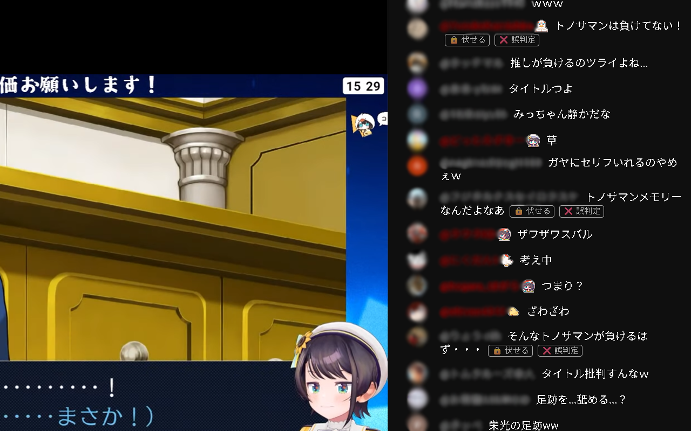

# Fresh Live Chat

**ゲーム配信チャットのネタバレフィルター**

[English README](README.md)

---

Fresh Live Chat は、YouTubeのゲーム配信（ライブ・アーカイブ）のチャット欄から、ネタバレ・匂わせ・攻略ヒントなどを自動検出・非表示にする Chrome 拡張機能です。限られた推しとの時間を、誰もがより快適に過ごせるようにと思って作りました。

フィルタリングは2段階で行われます。まずキーワードマッチによる瞬時の検出、次に Claude AI が文脈を理解してより精密に判定します。アカウント登録不要。インストールするだけで動作します。

---

## スクリーンショット

| ポップアップUI | ネタバレブロック時 | クリックで表示 |
|--------------|----------------|-------------|
|  |  |  |

---

## 主な機能

**2段階AIフィルタリング**
- Stage 1（瞬時）: キーワードマッチによる高速フィルタ
- Stage 2（AI判定）: Claude AI が文脈を理解してネタバレかどうかを精密に判定
- 誤検出を最小限に抑えつつ、見逃しを防ぐ2重チェック構造

**アーカイブ・ライブ両対応**
- アーカイブ（録画配信）のチャットリプレイをフィルタ
- ライブ配信中のリアルタイムフィルタリングにも対応

**ジャンル別テンプレート**
- RPG、推理・ミステリー、アクション・ホラーなどジャンルを選ぶだけで精度が向上
- 攻略ヒント・指示系コメント（「まだいってないところあるよ」「これ負けイベだよ」等）も検出

**ゲーム進行状況に連動**
- 現在プレイ中のチャプターを登録すると、すでに通過した部分への言及は非表示にしない
- まだ到達していない部分のネタバレと、すでに通過済みの内容を自動的に区別

**動画タイトルからゲームを自動推測**
- 動画タイトルからプレイ中のゲームを自動的に推測し、より精度の高い判定を実現

**カスタムNGワード**
- 自分だけのNGワードリストを作成し、任意のコメントを即時フィルタ

**3段階のフィルター強度**
- 厳格: 明確なネタバレ、匂わせ、攻略ヒントをすべてブロック
- 標準: 明確なネタバレと匂わせのみブロック（デフォルト）
- 緩め: 明確なネタバレのみをブロック

---

## インストール

### Chrome Web Store からインストール

> Chrome Web Store URL — 公開準備中

### ローカルビルド（開発版）

```bash
# 1. リポジトリをクローン
git clone https://github.com/delacuna/fresh-live-chat.git
cd fresh-live-chat

# 2. 依存パッケージをインストール
pnpm install

# 3. ビルド
pnpm build

# 4. Chrome に読み込む
#    chrome://extensions を開く → 「デベロッパーモード」を有効化 → 「パッケージ化されていない拡張機能を読み込む」
#    apps/chrome-ext/dist/ フォルダを選択
```

---

## 使い方

1. YouTubeでゲーム配信のページを開く
2. ブラウザ右上の Fresh Live Chat アイコンをクリックしてポップアップを開く
3. ゲームタイトルまたはジャンルを選択
4. 設定はすぐに反映され、以降は自動でフィルタリングが動作します

---

## プライバシーについて

- **データはローカル保存**: 設定・判定結果はすべてお使いのブラウザ内にのみ保存
- **チャット内容はサーバーに保存しない**: AI判定のためにコメントテキストを送信しますが、ログとして保存・記録することは一切ありません
- **APIキー不要**: Anthropic APIキーをユーザーが用意する必要はありません。Fresh Live Chat が安全なプロキシ経由で管理しています
- **アカウント登録不要**: インストールするだけで即使用可能

[プライバシーポリシー（詳細）](https://github.com/delacuna/fresh-live-chat/blob/main/docs/privacy-policy.md)

---

## 開発者向け情報

### 技術スタック

| レイヤー | 技術 |
|---------|------|
| 言語 | TypeScript |
| 拡張機能UI | React + Vite |
| ビルド | Turborepo + pnpm workspaces |
| プロキシ | Cloudflare Workers (Hono) |
| AI | Anthropic Claude API (Haiku) |

### ディレクトリ構成

```
apps/
  chrome-ext/       # Chrome拡張機能（コンテンツスクリプト + ポップアップUI）
  proxy/            # 軽量APIプロキシ（Cloudflare Workers）
packages/
  shared/           # 共有型定義・ユーティリティ
  knowledge-base/   # ゲーム別ネタバレデータ（JSON）+ ジャンルテンプレート
```

### ビルド方法

```bash
pnpm install        # 依存パッケージをインストール
pnpm build          # 全パッケージ・アプリをビルド
```

### プロキシのローカル起動

```bash
cd apps/proxy
pnpm wrangler dev   # http://localhost:8787 でローカルプロキシが起動します
```

ローカル開発時は、ポップアップのプロキシURL設定を `http://localhost:8787` に変更してください。

---

## ライセンス

MIT

---

## 問い合わせ・バグ報告

[GitHub Issues](https://github.com/delacuna/fresh-live-chat/issues) からお気軽にお問い合わせください。
